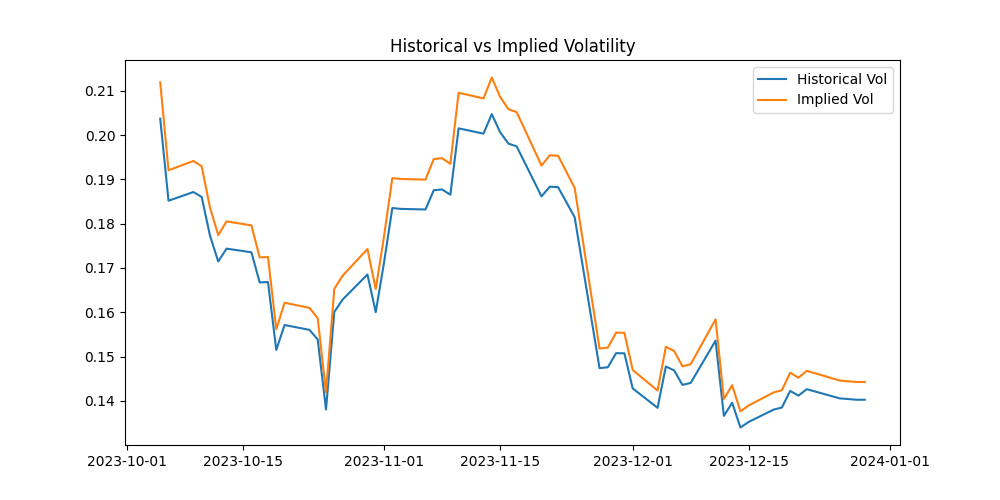
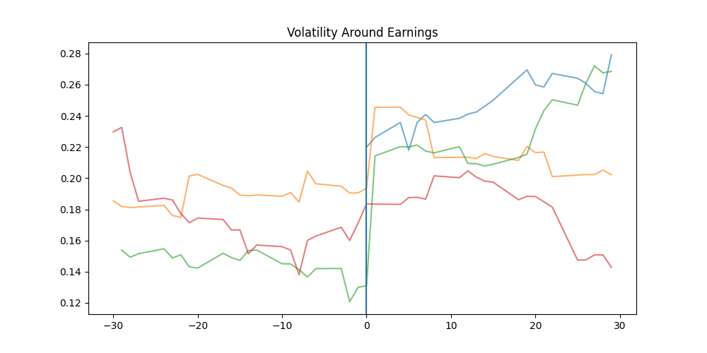
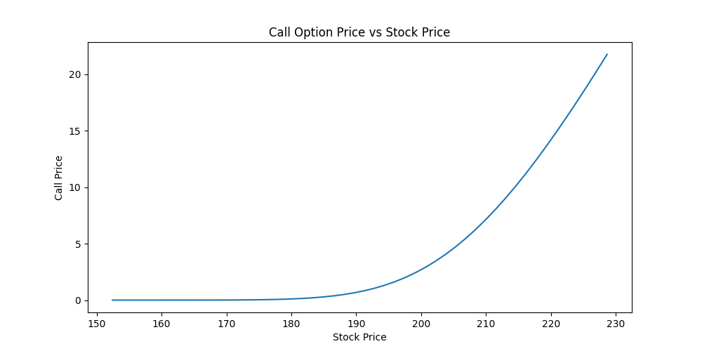
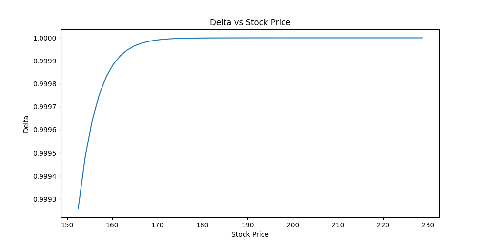
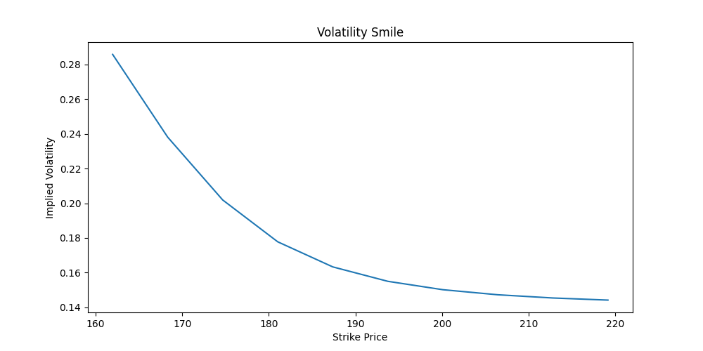
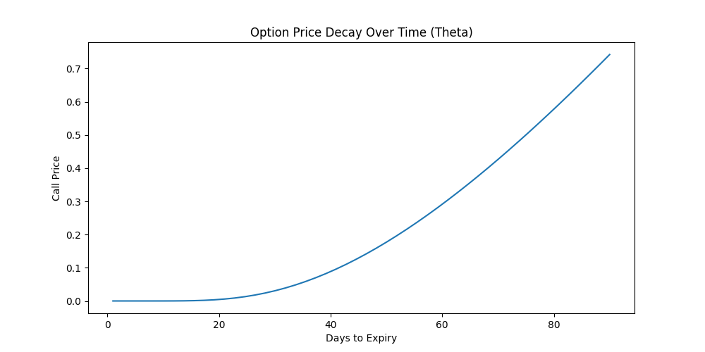

# Options-Analytics
Options Analytics and Volatility Modeling System


## Overview

This project implements an end-to-end options analytics system in Python based on the Black–Scholes framework and real market data. It retrieves historical stock price data, estimates historical volatility, prices European options, computes implied volatility, and evaluates option Greeks.
The system also produces multiple visual analytics commonly used in quantitative finance, enabling analysis of volatility behavior, option pricing dynamics, and risk sensitivities. The repository includes both the complete implementation used to perform the analysis and the generated visualizations.

## Key Features

- Fetch real stock market data using Yahoo Finance
- Clean and preprocess financial time series
- Compute log returns and historical volatility
- Implement the Black–Scholes option pricing model
- Calculate option Greeks (Delta, Gamma, Vega)
- Estimate implied volatility using the Newton–Raphson method
- Compare historical vs implied volatility
- Analyze volatility behavior around earnings announcements
- Generate volatility smile
- Visualize theta decay

## Project Structure

```
options-analytics/
│
├── main.py              # Main script executing the analytics pipeline
├── black_scholes.py     # Black–Scholes model implementation
├── market_data.py       # Market data retrieval and preprocessing
├── requirements.txt     # Python dependencies
├── README.md            # Project documentation
├── .gitignore           # Files ignored by Git
│
└── results/             # Generated graphs and analysis outputs
    ├── historical_vs_implied_vol.png
    ├── volatility_earnings.png
    ├── option_price_vs_stock.png
    ├── delta_vs_stock.png
    ├── volatility_smile.png
    └── theta_decay.png
```

## Installation

## Installation

1. Clone the repository

```bash
git clone https://github.com/YOUR_USERNAME/options-analytics.git
cd options-analytics
```

2. Install required packages

```bash
pip install -r requirements.txt
```

---

## Usage

Run the main script:

```bash
python main.py
```

You will be prompted to provide:

- **Stock ticker** (example: `AAPL`)
- **Days to option expiry** (example: `30`)
- **Strike percentage relative to current price** (example: `1.05` for 5% OTM)

## The script will automatically:

- Download historical stock data
- Compute returns and volatility
- Price options using the Black–Scholes model
- Estimate implied volatility
- Generate multiple analytical plots
- Save all plots inside the results/ folder


## Results

### Historical vs Implied Volatility



Compares realized volatility with implied volatility derived from the Black–Scholes model.  
Generally, **IV > HV**, reflecting the **Volatility Risk Premium (VRP)** embedded in option prices.

---

### Volatility Around Earnings



Volatility tends to increase around earnings announcements due to uncertainty regarding company performance and potential price reactions.

---

### Option Price vs Stock Price



Illustrates how the value of a call option increases as the underlying stock price rises, demonstrating the convex payoff structure of options.

---

### Delta vs Stock Price



Delta measures the sensitivity of the option price to changes in the underlying asset price. As the option becomes more in-the-money, delta approaches 1.

---

### Volatility Smile



The volatility smile shows how implied volatility varies across different strike prices, reflecting real market behavior not captured by the constant volatility assumption.

---

### Theta Decay



Theta decay demonstrates how option value decreases as time to expiration approaches, highlighting the impact of time decay on options pricing.


## Financial Concepts Used

### Black–Scholes Model

Used to price European options based on five parameters:

- **Stock price (S)**
- **Strike price (K)**
- **Time to maturity (T)**
- **Risk-free interest rate (r)**
- **Volatility (σ)**

---

### Historical Volatility

- **Historical Volatility = Std(Log Returns) × √252**

---

### Implied Volatility

- Implied volatility is computed numerically using the **Newton–Raphson method**, solving for volatility such that the **Black–Scholes price matches the observed market price**.

## Limitations

- Assumes European option exercise
- Assumes constant volatility (Black–Scholes assumption)
- Market option prices are simulated for demonstration purposes
- Uses US 10Y Treasury yield as a proxy for the risk-free rate

## Possible Improvements

- Integrate real option chain data
- Add support for put option analytics
- Implement stochastic volatility models (e.g., Heston model)
- Build an interactive dashboard using Streamlit

## Dependencies

The project uses the following Python libraries:

numpy

pandas

matplotlib

scipy

yfinance

Install them with:

pip install -r Requirements.txt

## Author

Dhyey Desai

## License

This project is intended for educational and research purposes.
